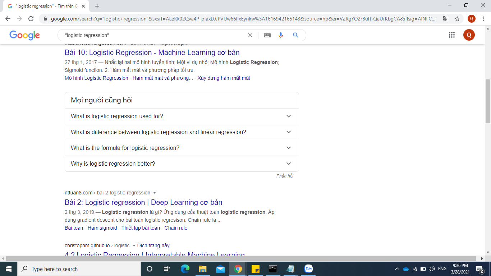
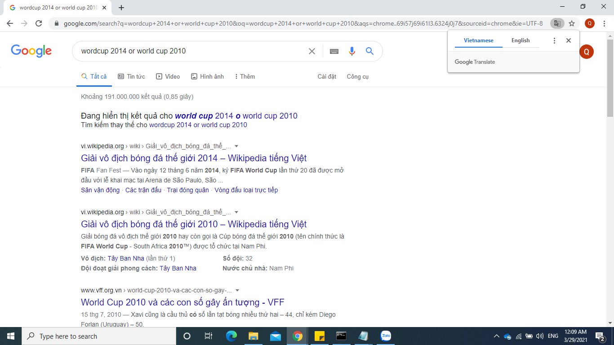

# QT11. TÌM KIẾM GOOGLE NÂNG CAO: TÌM KIẾM THÔNG TIN HIỆU QUẢ HƠN

# 1. Tìm kiếm cụm từ chính xác

Một cách để bạn có thể chủ động kiểm soát kết quả tìm kiếm trên Google tốt hơn đó chính là tìm kiếm các trang web có chứa chính xác cụm từ đó. Bạn chỉ cần bỏ 2 dấu ngoặc kép vào đầu và cuối của cụm từ đó.

Ví dụ: bạn cần tìm cụm từ "logistic regression" thì kết quả tìm kiếm sẽ được hiển thị lên có chứa đúng cụm từ "logistic regression"

# 2. Tìm kiếm với nhiều cụm từ

Trên google tìm kiếm, bạn có thể chủ động tìm kiếm kết quả với nhiều cụm từ khóa khác nhau. Bằng cách thêm OR vào giữa các cụm từ mà bạn muốn tìm kiếm.

Ví dụ: bạn muốn tìm các trang web với kết quả là world cup 2014 và world cup 2010 thì hãy tìm kiếm như sau world cup 2014 OR world cup 2010

