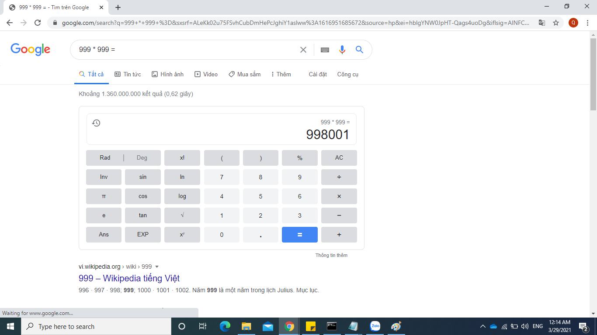
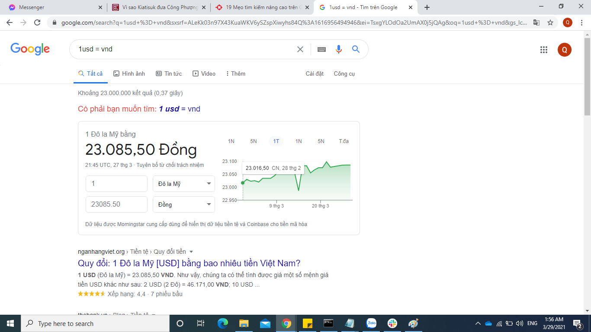
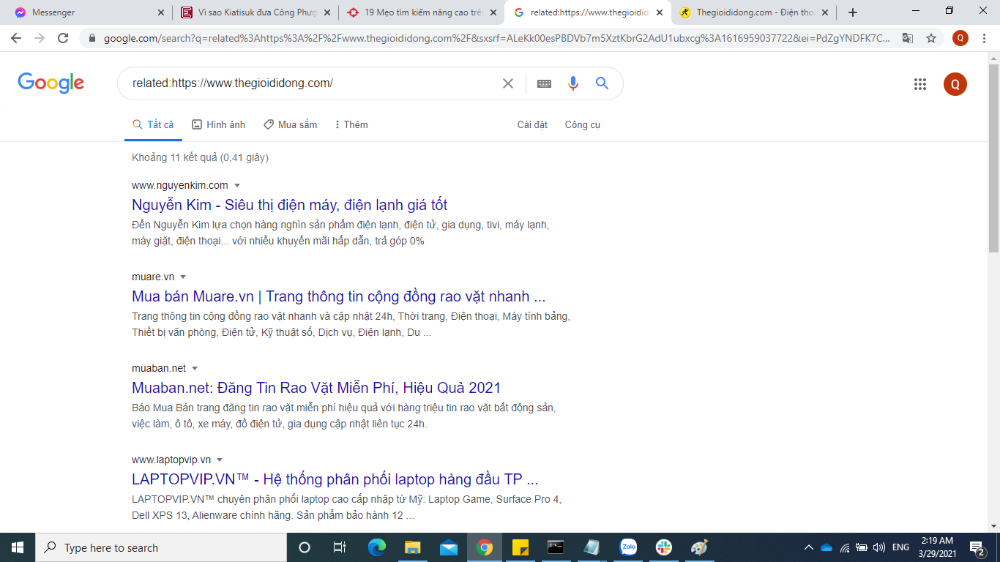

# QT11. TÌM KIẾM GOOGLE NÂNG CAO: TÌM KIẾM THÔNG TIN HIỆU QUẢ HƠN

# 1. Tìm kiếm cụm từ chính xác

Một cách để bạn có thể chủ động kiểm soát kết quả tìm kiếm trên Google tốt hơn đó chính là tìm kiếm các trang web có chứa chính xác cụm từ đó. Bạn chỉ cần bỏ 2 dấu ngoặc kép vào đầu và cuối của cụm từ đó.

Ví dụ: bạn cần tìm cụm từ "logistic regression" thì kết quả tìm kiếm sẽ được hiển thị lên có chứa đúng cụm từ "logistic regression"

# 2. Tìm kiếm với nhiều cụm từ

Trên google tìm kiếm, bạn có thể chủ động tìm kiếm kết quả với nhiều cụm từ khóa khác nhau. Bằng cách thêm OR vào giữa các cụm từ mà bạn muốn tìm kiếm.

Ví dụ: bạn muốn tìm các trang web với kết quả là world cup 2014 và world cup 2010 thì hãy tìm kiếm như sau world cup 2014 OR world cup 2010

# 3. Google tính toán

Google còn có tích hợp thêm chức năng tính toán cho người dùng thay vì người dùng phải tìm kiếm chức năng Calculator trên máy tính thì người dùng chỉ cần nhập phép tính vào ô tìm kiếm.

Ví dụ: bạn cần tính phép tính 999 * 999 thì bạn chỉ cần nhập 999 * 999 = vào ô tìm kiếm.

# 4. Chuyển đổi tiền tệ, khối lượng, nhiệt độ

Google có chức năng chuyển đổi các loại từ mệnh giá cho tới khối lượng hoặc các đơn vị nhiệt độ. Bạn chỉ cần gõ vào ô tìm kiếm giá trị tiền tệ và đơn vị muốn đổi vào.

Ví dụ: bạn có thể gõ 1 usd = vnd vào ô gõ tìm kiếm. Google sẽ cho ra kết quả ngay lập tức

# 5. Tìm kiếm các trang web liên quan

Hiện nay vấn đề tìm các trang web liên quan với trang web mà bạn đang quan tâm. 

Ví dụ như bạn đang quan tâm về lĩnh vực mua bán các thiết bị điện thoại, công nghệ, ... Và bạn muốn biết các trang web liên quan tới lĩnh vực ấy nhưng bạn chỉ biết có trang web http://thegioididong.vn. Bạn chỉ cần lên google gõ vào từ khóa related:http://thegioididong.vn

